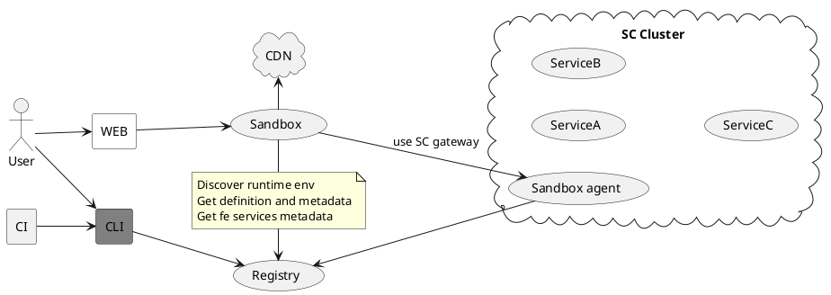

# Scalecube CLI
> **NOTICE** this package is experimental

Scalecube CLI build to excellent your development and give

### sc def [file] [interface]
Take interface and create service definition

### sc doc [file] [interface]
Take interface with ts doc and create documentation

### sc sandbox-agent --port [port] --seed [seed] --registry [registry] 
### sc registry --f [file]
### sc sandbox --registry [registry]
Create sandbox

